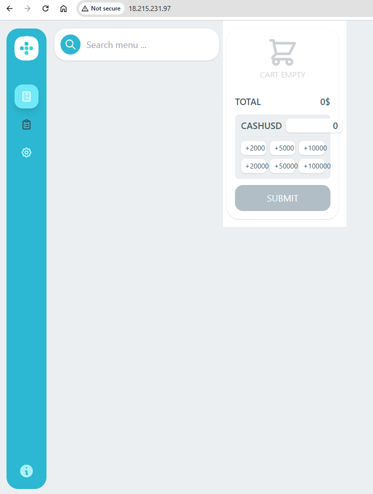
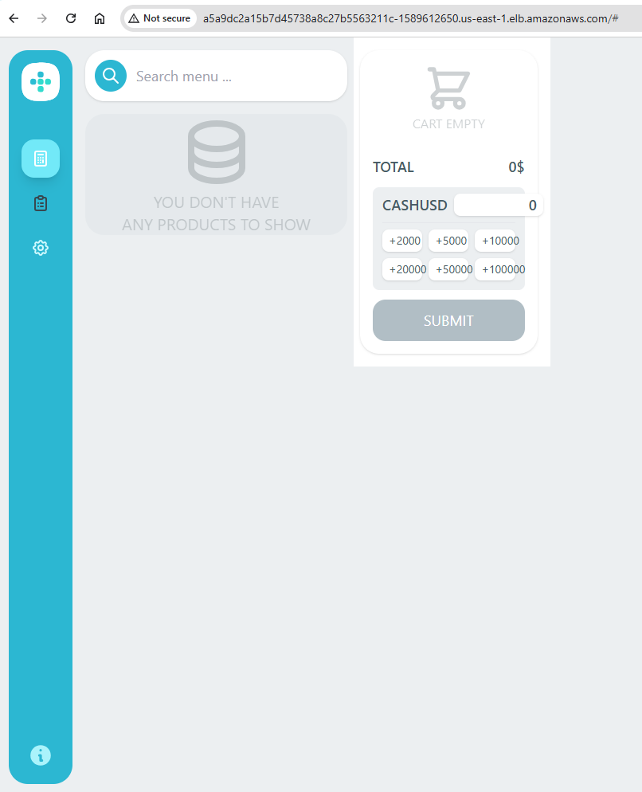

# DevOps Final Exam Submission - Go Coffee Shop

## 1. Summary

This project demonstrates the deployment of the "Go Coffee Shop" multi-container application across two distinct environments: a development environment hosted on an AWS EC2 instance using Docker Compose, and a production-like environment orchestrated by Amazon EKS (Elastic Kubernetes Service).

The solution leverages Infrastructure as Code (IaC) principles using Terraform to provision and manage all AWS resources. Key AWS services utilized include EC2, VPC (with public and private subnets), Internet Gateway, Route Tables, Security Groups, RDS for PostgreSQL (with AWS Secrets Manager for credentials), ECR for private Docker image storage, and EKS for container orchestration.

A CI/CD pipeline using GitHub Actions is implemented for one of the microservices to demonstrate automated image scanning (Trivy), pushing to ECR, and deploying updates to EKS. Monitoring is addressed conceptually using Amazon CloudWatch with Container Insights, including the setup of dashboards and alarms for key performance indicators.

## 2. Architecture

The solution comprises two main environments: Development and Production, each with distinct architectural setups.

### 2.1 Development Environment Architecture

*   **Overview:** A single AWS EC2 instance hosts the entire application stack using Docker Compose for container orchestration.
*   **User Access:** Users access the web application directly via the Public IP address of the EC2 instance.
*   **Compute:**
    *   1 x AWS EC2 instance (`t2.micro`) running Amazon Linux 2.
    *   Located in a public subnet within the `dev` workspace VPC.
*   **Container Orchestration:** Docker Compose.
    *   Manages all application and backing service containers on the EC2 instance.
*   **Application Containers (managed by Docker Compose):**
    *   `go-coffeeshop-web`
    *   `go-coffeeshop-proxy`
    *   `go-coffeeshop-product`
    *   `go-coffeeshop-counter`
    *   `go-coffeeshop-barista`
    *   `go-coffeeshop-kitchen`
*   **Backing Service Containers (managed by Docker Compose):**
    *   `postgres:14-alpine` (for database)
    *   `rabbitmq:3.11-management-alpine` (for message queuing)
*   **Data Flow (Simplified):**
    *   User Request -> EC2 Instance (Port 80) -> `web` container.
    *   Internal calls: `web` -> `proxy` -> (`product`, `counter`).
    *   Worker services (`barista`, `kitchen`, `counter`) interact with `postgres` and `rabbitmq` containers.

### 2.2 Production Environment Architecture

*   **Overview:** A resilient and scalable setup using Amazon EKS for container orchestration, AWS RDS for the database, and AWS ECR for private image storage.
*   **User Access:** Users access the web application via an AWS Network Load Balancer (NLB), which distributes traffic to the `web-app` pods running in EKS.
*   **Compute (EKS Cluster: `prod-eks-cluster`):**
    *   **Control Plane:** Managed by AWS EKS.
    *   **Worker Nodes:** 2 x `t3.small` EC2 instances in a Managed Node Group (`prod-eks-node-group`), running in public subnets across two Availability Zones (`us-east-1a`, `us-east-1b`) for high availability of the data plane and direct outbound internet access.
*   **Container Orchestration:** Amazon EKS (Kubernetes version 1.29).
*   **Networking:**
    *   AWS VPC (`prod-vpc`) with public and private subnets.
    *   Internet Gateway (`prod-igw`) for outbound traffic from public subnets.
    *   Public subnets for EKS worker nodes and the NLB. These subnets are tagged for EKS (`kubernetes.io/cluster/...` and `kubernetes.io/role/elb`).
    *   Private subnets for the RDS database, tagged for EKS internal ELB role.
    *   AWS Network Load Balancer (NLB): Automatically provisioned by the Kubernetes `web-service` of type `LoadBalancer`.
*   **Application Pods (Managed by EKS Deployments):**
    *   `go-coffeeshop-web` (replicas managed by Deployment, exposed via NLB)
    *   `go-coffeeshop-proxy` (internal ClusterIP service)
    *   `go-coffeeshop-product` (internal ClusterIP service, with HPA)
    *   `go-coffeeshop-counter` (internal ClusterIP service)
    *   `go-coffeeshop-barista` (internal ClusterIP service, worker)
    *   `go-coffeeshop-kitchen` (internal ClusterIP service, worker)
*   **Backing Service Pods (Managed by EKS Deployments/StatefulSets):**
    *   `rabbitmq` (running as a Deployment with a ClusterIP service).
*   **Database:**
    *   AWS RDS for PostgreSQL (`db.t3.micro`, Single-AZ) named `prod-postgres-db`.
    *   Located in private subnets, accessible only from within the VPC (specifically from the EKS cluster security group).
*   **Image Registry:**
    *   AWS ECR: 6 private repositories, one for each microservice. EKS pods pull images from here.
*   **Secrets Management:**
    *   AWS Secrets Manager: Stores RDS master credentials (`prod/rds/db-credentials`).
    *   Kubernetes Secrets:
        *   `rds-db-credentials`: Manually created in K8s, populated with values from AWS Secrets Manager (for simplicity in this exam).
        *   `rabbitmq-credentials`: Manually created in K8s for RabbitMQ user/pass.
*   **Data Flow (Simplified):**
    *   User Request -> Internet -> NLB (Port 80) -> `web-app` Pods.
    *   Internal calls: `web-app` Pods -> `proxy-service` (ClusterIP) -> (`product-service` (ClusterIP), `counter-service` (ClusterIP)).
    *   Worker services (`barista-service`, `kitchen-service`, `counter-service` Pods) -> `rabbitmq-service` (ClusterIP) AND RDS instance (via its private endpoint).
*   **Monitoring:**
    *   CloudWatch Container Insights (enabled via EKS Add-on with EKS Pod Identity) collects metrics and logs from EKS cluster, nodes, and pods.
    *   NLB metrics are sent to CloudWatch.

### 2.3 CI/CD Flow (Example: Product Service)

*   **Trigger:** Manual trigger (`workflow_dispatch`) of GitHub Actions workflow (e.g., `.github/workflows/product-cicd.yml`).
*   **Steps:**
    1.  **Authentication:** GitHub Action authenticates to AWS using secrets (Access Key ID, Secret Access Key).
    2.  **ECR Login:** Docker client in the GitHub runner logs into AWS ECR.
    3.  **Pull Upstream:** Pulls the `cuongopswat/go-coffeeshop-product:latest` image from Docker Hub.
    4.  **Scan Image:** Scans the pulled image using Trivy for `CRITICAL` and `HIGH` vulnerabilities. (Pipeline configured to proceed even if vulnerabilities are found for demo purposes, by setting Trivy `exit-code: 0`).
    5.  **Tag Image:** Tags the image for the private ECR repository (`go-coffeeshop-product`) with the Git commit SHA and `latest`.
    6.  **Push to ECR:** Pushes both tags to the private AWS ECR repository.
    7.  **Configure `kubectl`:** The runner configures `kubectl` to connect to the `prod-eks-cluster`.
    8.  **Deploy to EKS:** Uses `kubectl set image deployment/product-deployment ...` to update the `product-service` container with the newly pushed image (tagged with Git SHA), triggering a rolling update in EKS.
*   This process is replicated for all 6 application microservices using separate workflow files.

## 3. Component Description

### 3.1 AWS VPC (Virtual Private Cloud)
*   **Purpose:** Provides an isolated network environment in AWS.
*   **Configuration:** A single VPC (CIDR: `10.0.0.0/16`) is used, partitioned by Terraform workspaces (`dev` and `prod`) for resource tagging and conditional resource creation.
*   **Subnets:**
    *   **Dev:** 1 Public (`10.0.1.0/24`), 1 Private (`10.0.2.0/24`).
    *   **Prod:** 2 Public EKS Node Subnets (`10.0.10.0/24`, `10.0.11.0/24` in different AZs, tagged for EKS ELB role), 2 Private RDS Subnets (`10.0.100.0/24`, `10.0.101.0/24` in different AZs, tagged for EKS internal-ELB role).
*   **Networking:** Includes an Internet Gateway (`main_igw`), and Route Tables (`public_rtb_dev`, `public_rtb_prod`) for internet access for public subnets. Prod EKS worker nodes are in public subnets, so no NAT Gateway was implemented for this "easiest solution" approach.

### 3.2 Terraform
*   **Purpose:** Infrastructure as Code (IaC) tool used to define and provision all AWS resources declaratively.
*   **Backend:** Uses an S3 backend (`nhutle-s3-bucket`) for state file storage and management.
*   **Workspaces:** `dev` and `prod` workspaces are used to manage separate environment configurations and resources within the same set of Terraform files, utilizing conditional logic (`count = terraform.workspace == "..." ? 1 : 0`).

### 3.3 Development Environment
*   **EC2 Instance:** A `t2.micro` instance (`dev-app-server`) is provisioned in a public subnet.
*   **Docker & Docker Compose:** Installed on the EC2 instance via `user_data` script.
*   **Application Stack:** The full Go Coffee Shop application (6 microservices + PostgreSQL + RabbitMQ) is run as Docker containers managed by `docker-compose.yml`. Environment variables, including secrets, are managed via an `.env` file on the EC2 instance.

### 3.4 Amazon ECR (Elastic Container Registry)
*   **Purpose:** Serves as the private Docker registry for storing production-ready container images.
*   **Setup:** 6 ECR repositories were created via Terraform (one for each microservice).
*   **Image Push:** Images were initially pulled from `cuongopswat` on Docker Hub, re-tagged, and pushed to these ECR repositories. CI/CD pipelines update these images.
*   **Configuration:** `force_delete = true` is set in Terraform for easier cleanup post-exam. Image scanning on push is enabled.

### 3.5 Amazon RDS (Relational Database Service) & AWS Secrets Manager
*   **RDS Instance:** A PostgreSQL `db.t3.micro` instance (`prod-postgres-db`) is used for the production database, configured for Single-AZ (no HA, no read replicas) to align with Free Tier. It's placed in private subnets.
*   **Secrets Manager:** The master username (`coffeeshopadmin`) and a randomly generated password for the RDS instance are stored securely in AWS Secrets Manager (`prod/rds/db-credentials`). RDS is configured to use these credentials.

### 3.6 Amazon EKS (Elastic Kubernetes Service)
*   **Purpose:** Provides the managed Kubernetes control plane and worker nodes for the production environment.
*   **Cluster:** `prod-eks-cluster` (version 1.29).
*   **Node Group:** `prod-eks-node-group` consisting of 2 x `t3.small` EC2 instances running in public subnets to ensure network connectivity for node bootstrapping and image pulls.
*   **IAM Roles:** Dedicated IAM roles for the EKS cluster and Node Group were created with necessary AWS managed policies.
*   **Add-ons:**
    *   `Amazon EKS Pod Identity Agent`: Installed to allow Kubernetes service accounts to assume IAM roles.
    *   `Amazon CloudWatch Observability`: Installed to enable Container Insights for metrics and log collection, using EKS Pod Identity for its `cloudwatch-agent` service account.

### 3.7 Kubernetes Manifests (YAMLs)
Located in `prod-environment/kube-manifests/`.
*   **Secrets:**
    *   `rabbitmq-credentials`: Stores RabbitMQ default user/password (base64 encoded).
    *   `rds-db-credentials`: Stores RDS user/password/dbname (base64 encoded), manually populated from values in AWS Secrets Manager for deployment simplicity.
*   **Deployments:** One Kubernetes `Deployment` per microservice (6 app services + 1 RabbitMQ).
    *   Images are pulled from the private ECR repositories.
    *   Environment variables are configured using direct values, ConfigMap references (not explicitly used yet but an option), and SecretKeyRefs for credentials.
    *   Connection URLs (`PG_URL`, `RABBITMQ_URL`, etc.) are constructed using shell-like variable expansion in the pod environment.
    *   Liveness/Readiness probes (TCP or HTTP) are defined for services that expose ports. Barista and Kitchen were exempted by the examiner.
*   **Services:**
    *   `ClusterIP` services for RabbitMQ and all backend microservices (`product`, `counter`, `barista`, `kitchen`, `proxy`) for internal DNS-based discovery.
    *   `LoadBalancer` service for `web-service`, which provisions an AWS Network Load Balancer (NLB) to expose the application externally on port 80.
*   **HPA (HorizontalPodAutoscaler):**
    *   `product-hpa` targets `product-deployment`, configured to scale between 1 and 3 replicas based on CPU utilization (target 50%).

### 3.8 GitHub Actions (CI/CD)
Located in `.github/workflows/`.
*   **Purpose:** Automate the process of scanning, pushing, and deploying updates for each microservice.
*   **Workflow (Example: `product-cicd.yml`):**
    1.  Triggered manually (`workflow_dispatch`) or by push to `main`.
    2.  Configures AWS credentials using GitHub Secrets.
    3.  Logs into AWS ECR.
    4.  Pulls the corresponding image from `cuongopswat` on Docker Hub.
    5.  **Scans the image using Trivy** for `CRITICAL,HIGH` vulnerabilities (`exit-code: '0'` set for demo to allow pipeline completion despite vulnerabilities found in the public image).
    6.  Tags the image with the Git SHA and `latest`.
    7.  **Pushes the tagged images to the private ECR repository.**
    8.  Configures `kubectl` to connect to the `prod-eks-cluster`.
    9.  **Deploys the application by updating the K8s Deployment's image tag** to the new Git SHA-tagged image from ECR, using `kubectl set image` (push mechanism).
*   Similar workflows are set up for all 6 application microservices.

### 3.9 Amazon CloudWatch (Monitoring)
*   **Container Insights:** Enabled via the "Amazon CloudWatch Observability" EKS add-on, using EKS Pod Identity for agent permissions. This provides metrics for EKS cluster, nodes, pods, services, and collects logs.
*   **Custom Dashboard (`CoffeeShopProdDashboard`):**
    *   Widgets created to display:
        *   Node CPU Utilization (%)
        *   Node Memory Utilization (%)
        *   Pods CPU Utilization (%) (broken down by service)
        *   Pods Memory Utilization (%) (broken down by service)
        *   Web Service - NLB Request Count (using `ActiveFlowCount` or `RequestCount` from NLB, summed across AZs)
        *   Web Service - NLB Target Health (using `UnHealthyHostCount` from NLB Target Group)
    *   *Note on 4xx/5xx errors:* Precise HTTP 4xx/5xx errors would ideally be derived from application logs using CloudWatch Logs Insights queries and custom metrics, or by using an Application Load Balancer. The current dashboard uses NLB health metrics as a proxy.
*   **Alarms Configured:**
    1.  `EKSNodeGroupAtMaxSize-Prod`: Triggers if EKS node group `GroupInServiceInstances` >= `max_size` (3).
    2.  `ELB-RequestCount-Anomaly-Prod`: Triggers on anomalous changes in NLB `ActiveFlowCount` using Anomaly Detection.
    3.  `WebApp-HighPodCPU-Prod`: Triggers if `PodCpuUtilization` for `web-deployment` >= 80%.
    4.  `WebService-UnHealthyHosts-Prod`: Triggers if `UnHealthyHostCount` for the `web-service` NLB target group >= 1.

### 3.10 Security Considerations
*   **IAM:** Least privilege attempted via specific IAM roles for EKS Cluster, EKS Nodes, and EKS Pod Identity for the CloudWatch add-on. CI/CD credentials are via GitHub secrets.
*   **Network:** RDS in private subnets. Security Groups restrict traffic (e.g., RDS SG allows access only from EKS Cluster SG). EKS worker nodes in public subnets for simplified outbound access in this setup.
*   **Secrets Management:** RDS credentials managed by AWS Secrets Manager. Kubernetes secrets used for RabbitMQ and to pass RDS credentials to pods.
*   **Image Security:** Trivy scanning in CI/CD. ECR image scanning enabled on push.
*   **In Transit (Production):** External web traffic to NLB is currently HTTP/80. For full production, HTTPS/443 would be configured on the NLB using an ACM certificate (e.g., managed by AWS Load Balancer Controller). Internal EKS traffic and EKS-RDS traffic is within the VPC.

### 3.11 Health Checks
*   **Kubernetes Probes:** Liveness and Readiness probes (TCP or HTTP) implemented for services exposing ports (RabbitMQ, Product, Counter, Proxy, Web).
*   **Exemptions:** `barista` and `kitchen` services have no probes as per examiner guidance for simplicity, as they are worker-style services.
*   **Production Enhancement:** For services with HTTP probes, using dedicated `/healthz` or `/status` endpoints that perform deeper application-specific checks would be more robust than just checking `/`.

## 4. The Homepage of the Application

*   **Development Environment URL:** `http://[DEV_EC2_PUBLIC_IP_YOU_USED]`
    *   
*   **Production Environment URL:** `http://[PROD_NLB_DNS_NAME_FROM_OUTPUT]` (e.g., `http://a5a9dc2a15b7d45738a8c27b5563211c-1589612650.us-east-1.elb.amazonaws.com`)
    *   

## 5. User Guideline

### 5.1 Prerequisites
*   AWS Account with appropriate permissions.
*   AWS CLI installed and configured with credentials.
*   Terraform (version ~1.x) installed.
*   `kubectl` (version ~1.29) installed.
*   Git installed.
*   (Optional) Docker Desktop or Docker Engine if building/running images locally or for initial ECR push.

### 5.2 Repository Setup
1.  Clone the repository: `git clone https://github.com/nhut-le-opswat/devops-final-exam.git`
2.  Navigate to the repository root: `cd devops-final-exam`

### 5.3 Terraform Infrastructure Provisioning
All Terraform commands should be run from the `devops-final-exam/terraform/` directory.

1.  **Initialize Terraform:**
    ```bash
    terraform init -reconfigure
    ```
2.  **Select Workspace:**
    *   For Development: `terraform workspace select dev` (if it doesn't exist, `terraform workspace new dev` then select)
    *   For Production: `terraform workspace select prod` (if it doesn't exist, `terraform workspace new prod` then select)
3.  **Plan Changes:**
    ```bash
    terraform plan
    ```
4.  **Apply Changes:**
    ```bash
    terraform apply 
    # (Type 'yes' when prompted)
    ```
    *Note: Applying the 'prod' workspace will create EKS and RDS, which can take 20-30 minutes and incur costs.*

### 5.4 Development Environment Deployment (EC2 + Docker Compose)
1.  Ensure `dev` workspace infrastructure is applied via Terraform. Note the public IP of the `dev-app-server` EC2 instance.
2.  SSH into the Dev EC2 instance:
    ```bash
    ssh -i /path/to/your/[YOUR_KEY_PAIR].pem ec2-user@[DEV_EC2_PUBLIC_IP]
    ```
3.  On the EC2 instance, prepare the application directory and files:
    ```bash
    mkdir -p /home/ec2-user/coffeeshop
    cd /home/ec2-user/coffeeshop
    ```
4.  Create/upload `docker-compose.yml` (from `devops-final-exam/dev-environment/docker-compose.yml` in the repo).
5.  Create `.env` file in `/home/ec2-user/coffeeshop/` with necessary secrets:
    ```dotenv
    # Example .env content for dev EC2 Docker Compose
    POSTGRES_USER=coffeeshop_user
    POSTGRES_PASSWORD=[CHOOSE_A_DEV_DB_PASSWORD]
    POSTGRES_DB=coffeeshop_db
    RABBITMQ_USER=rabbit_user
    RABBITMQ_PASS=[CHOOSE_A_DEV_RABBITMQ_PASSWORD]
    ```
6.  Run Docker Compose:
    ```bash
    docker-compose up -d
    ```
7.  Check status: `docker-compose ps`
8.  Access: `http://[DEV_EC2_PUBLIC_IP]`

### 5.5 Production Image Preparation (Push to ECR)
*(This step was done once initially. CI/CD now handles updates. These are for reference if manual push is needed again).*
1.  Authenticate Docker to your AWS ECR:
    ```bash
    aws ecr get-login-password --region us-east-1 | docker login --username AWS --password-stdin [YOUR_AWS_ACCOUNT_ID].dkr.ecr.us-east-1.amazonaws.com
    ```
2.  For each of the 6 `cuongopswat/*` images (e.g., `go-coffeeshop-product`):
    ```bash
    docker pull cuongopswat/go-coffeeshop-product:latest
    docker tag cuongopswat/go-coffeeshop-product:latest [YOUR_AWS_ACCOUNT_ID].dkr.ecr.us-east-1.amazonaws.com/go-coffeeshop-product:latest
    docker push [YOUR_AWS_ACCOUNT_ID].dkr.ecr.us-east-1.amazonaws.com/go-coffeeshop-product:latest
    ```
    (Replace `[YOUR_AWS_ACCOUNT_ID]` and image names accordingly).

### 5.6 Production Application Deployment (EKS)
1.  Ensure `prod` workspace infrastructure (including EKS cluster) is applied via Terraform.
2.  Configure `kubectl` to connect to your EKS cluster:
    ```bash
    aws eks update-kubeconfig --region us-east-1 --name prod-eks-cluster
    ```
3.  Navigate to the Kubernetes manifests directory:
    ```bash
    cd devops-final-exam/prod-environment/kube-manifests/
    ```
4.  **Important Secret Creation:**
    *   Ensure `rds-credentials-secret.yaml` has the correct base64 encoded password for the RDS instance (password `fPpMIcJRd!1ryI6T` from AWS Secrets Manager, base64 is `ZlBwTUljSlJkITFyeUk2VA==`).
    *   Ensure `rabbitmq-secret.yaml` has correct base64 encoded credentials (user `rabbituser` -> `cmFiYml0dXNlcg==`, pass `rabbitpassword` -> `cmFiYml0cGFzc3dvcmQ=`).
5.  Apply all Kubernetes manifests:
    ```bash
    kubectl apply -f .
    ```
6.  Check status:
    *   Nodes: `kubectl get nodes -o wide` (should see 2 ready `t3.small` nodes).
    *   All Pods: `kubectl get pods --all-namespaces` (wait for all app pods in `default` and agent pods in `amazon-cloudwatch` / `kube-system` to be `Running` and `Ready`).
    *   Web Service Load Balancer: `kubectl get svc web-service` (wait for `EXTERNAL-IP` to be populated).
7.  Access: `http://[EXTERNAL_IP_OF_WEB_SERVICE]`

### 5.7 CI/CD (GitHub Actions)
1.  Ensure the following secrets are configured in the GitHub repository settings (Actions secrets):
    *   `AWS_ACCESS_KEY_ID`
    *   `AWS_SECRET_ACCESS_KEY`
    *   `AWS_ECR_ACCOUNT_ID` (e.g., `906314669216`)
    *   `AWS_REGION` (e.g., `us-east-1`)
    *   `EKS_CLUSTER_NAME` (e.g., `prod-eks-cluster`)
2.  The workflows are located in `.github/workflows/`. They are configured with `on: workflow_dispatch:` for manual triggering.
3.  To run a pipeline (e.g., for `product-service`):
    *   Go to the GitHub repository "Actions" tab.
    *   Select the desired workflow (e.g., "CI/CD for Product Service").
    *   Click "Run workflow", choose the branch (e.g., `main`), and run.
    *   Monitor the workflow steps. It will scan with Trivy (currently set to not fail the build on vulnerabilities for demo purposes), push to ECR, and update the EKS deployment.

### 5.8 Monitoring (CloudWatch)
1.  The "Amazon CloudWatch Observability" EKS add-on (with the "EKS Pod Identity Agent" add-on as a prerequisite) is installed via the AWS EKS Console.
2.  Access Container Insights: AWS Console -> CloudWatch -> Container Insights -> Performance monitoring. Select `prod-eks-cluster`.
3.  Access Custom Dashboard: AWS Console -> CloudWatch -> Dashboards. Select `CoffeeShopProdDashboard`.
4.  View Alarms: AWS Console -> CloudWatch -> Alarms -> All alarms.

### 5.9 Cleanup (VERY IMPORTANT TO AVOID COSTS)
Run from the `devops-final-exam/terraform/` directory.

1.  **Destroy Production Environment:**
    ```bash
    terraform workspace select prod
    terraform destroy 
    # (Confirm with 'yes'. This will take time. ECR repos might need 'force_delete=true' in main.tf 
    # or manual image deletion if destroy fails on them. We have 'force_delete=true' set.)
    ```
2.  **Destroy Development Environment:**
    ```bash
    terraform workspace select dev
    terraform destroy 
    # (Confirm with 'yes')
    ```
3.  **(Optional) Delete S3 Backend Bucket:** Manually delete `nhutle-s3-bucket` from S3 console if no longer needed.
4.  **(Optional) Delete CloudWatch Log Groups:** Manually delete log groups created by Container Insights if desired (e.g., `/aws/containerinsights/prod-eks-cluster/*`).
5.  **(Optional) Delete IAM Roles for Add-ons:** Manually delete the IAM role created for the CloudWatch Observability add-on's Pod Identity if it's not deleted by EKS when the add-on is removed (add-ons are typically removed when cluster is deleted).